# SpazzoReplayStatKit

Custom Observer & Replay Interface for Blizzard's Heroes of the Storm MOBA, with expanded statistics if replays are converted to have their battleground that is loaded replaced

* **Custom Stats per-game setup**

To convert replays to feature a vastly expanded number of statistics, drag and drop the .StormReplay file onto the dragAll_details.bat file or the desired map specific.bat file, the new replay will be placed alongside the existing replay with _stats appended to the file name(before the .stormreplay extension), at which point it can be opened like a standard replay through the in-game interface.

* **UI Installation**

In order to use the Replay & Observer interface, download the latest .StormInterface file in the releases inside your Heroes of the Storm interfaces directory(to get to this inside of Windows, press Windows key + R, and then enter "%userprofile%\documents\Heroes of the Storm\Interfaces" without quotation marks), and then it can be set as an Observer or Replay interface in the Observer and Replay tab of the game options.

* **UI Features**

Replace the Top Bar with a more feature-laden version, with things like Healing Fountain cooldown, Ability & Talent cooldowns, objectives carried, and more

All Heroes feature attachments to their Healthplates to display select cooldowns, like Johanna can the cooldown on any of her Abilities and select Talents, or Cho'Gall, who can display both Cho and Gall's Ability cooldowns at once

To open the settings for this UI, use the key combination of Alt+L

If watching a replay that has been converted to support expanded statistics, then more tabs will display to show a wide number of statistics that update throughout the replay, ranging from how much damage armor has prevented to that players heroic unit to how much damage a specific ability has done to heroic targets.

Timestamped statistics - Press ALT+2 to start recording statistics, then ALT+3 to stop recording statitsics, and then ALT+1 to display those statistics. This is useful if you wish to see how much Hero Damage was done between certain points of the game, like between an objective phase starting and the objective being collected.

Compatabiity with Ahli's Observer UI Settings Editor, allowing you to change the default settings to whatever you may desire.

It is also possible to export your settings and to override the existing defaults, by pressing the Export Settings button in the options menu, the current settings for the user interface will be saved to the Clipboard, and this can be pasted into a text file and dragged onto conversion\XportSettings\renameDraggedFile.bat to place it in that folder, and then if a .StormInterface file is dragged onto importCustomSettings.bat in that same folder, it will import the custom settings from the created CustomConfig.StormLayout file, and create a new interface you can change to with altered default settings. For more detailed instructions, open importCustomSettings.bat while there is no CustomConfig.StormLayout file present

* **Shortcuts**

You can display a complete list of Shortcuts by pressing Alt+H, as seen in 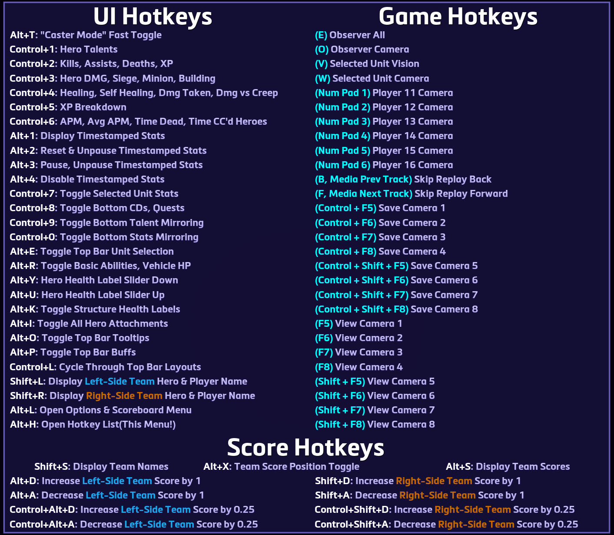

This can also be opened by pressing the Nexus Icon in the middle of the Top Bar

## Installation

* Observer and Replay Interface Installation, step-by-step:

  * Step 1: Click on the latest release, as seen here: 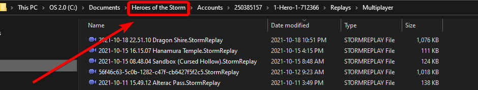

  * Step 2: Download the desired files, as seen here: 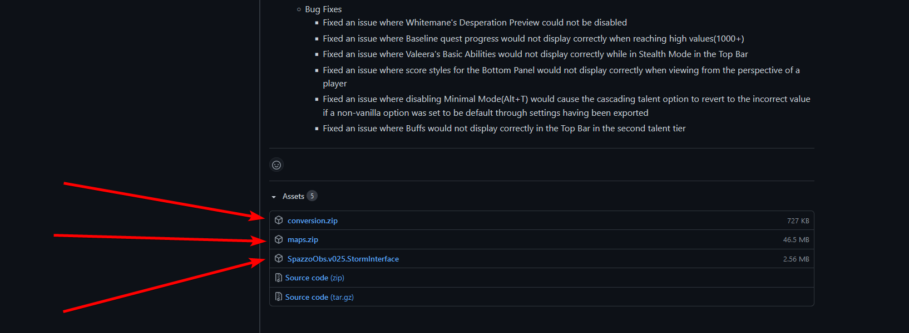  
  Only downloading the files desired, if you just want the interface without the ability to change settings, just grab the .StormInterface file, if you want to be able to export your settings to override the defaults, also download the conversion.zip file, and if you want to use the custom stat replay utility, then also download conversion.zip and maps.zip

  * Step 3: To navigate to where to place the .StormInterface file, open your Heroes of the Storm directory, click on the Watch tab, and then return to the base replay directory(if you aren't there), and then press the show in folder button, as seen here: 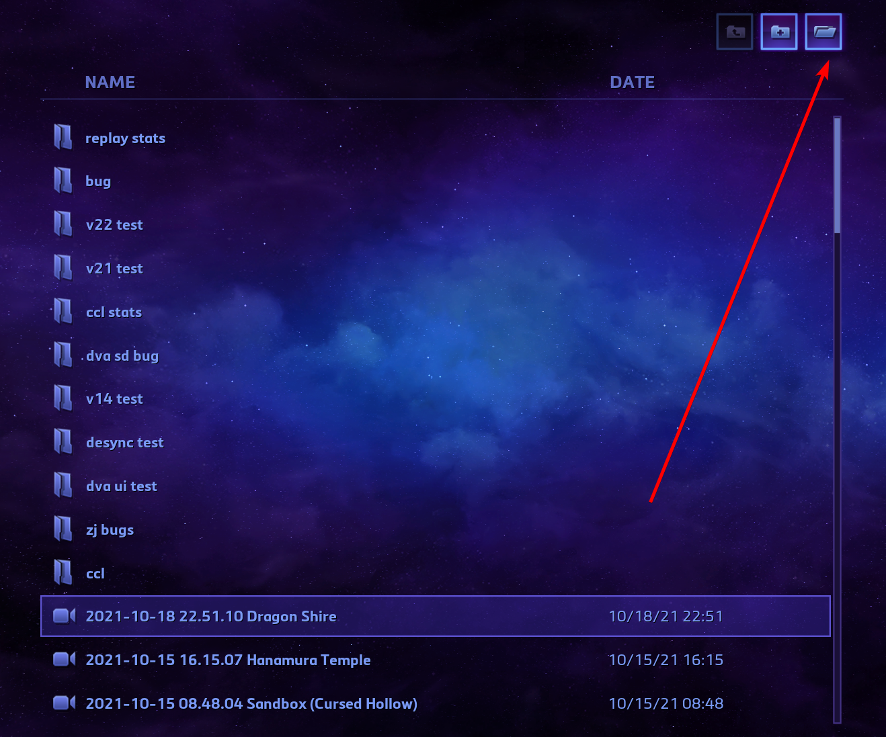  
  From there, navigate back to the Heroes of the Storm folder from there, as seen here: 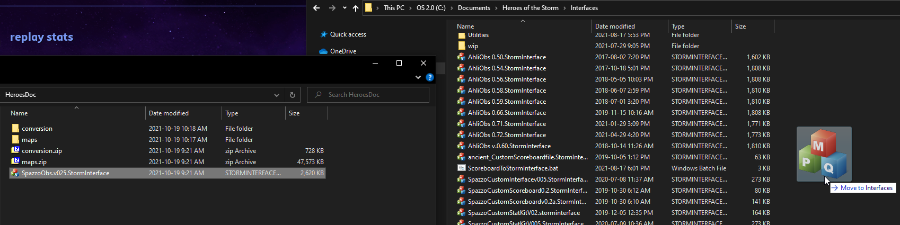  
  Where you will either already see an Interfaces folder, or you can create one, it should then look something like this 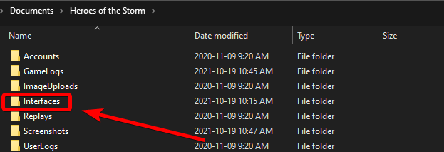  
  Then inside that Heroes of the Storm folder, place that .StormInterface file inside that Interfaces folder, as seen here: 

  * Step 4: Open the options menu in Heroes of the Storm, and then in the Observer and Replay tab, select the desired Observer Interface and Replay Interface, and click accept

* Export Observer Settings, step-by-step:

  * Step 1: Extract the conversion.zip file to your desired location, and inside of that extracted folder structure, navigate to conversion/XportSettings, and leave this folder open for now

  * Step 2: Load up a replay, and make the desired changes to the settings to how you want them to be by default, and then press the Export Settings button, as seen here: 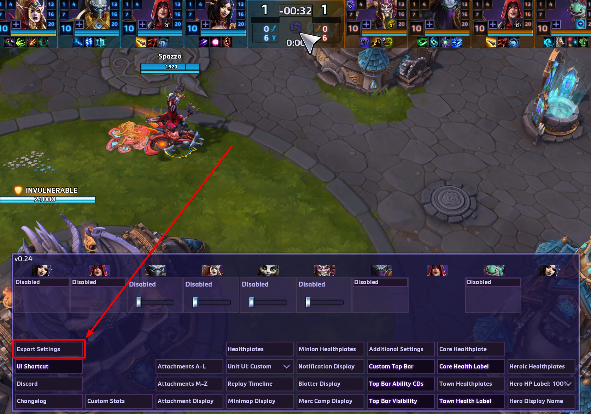

  * Step 3: Create a new text document in that XportSettings folder you left open, naming it whatever you desire, and then open that file, and paste the contents from your clipboard. This should look something like this 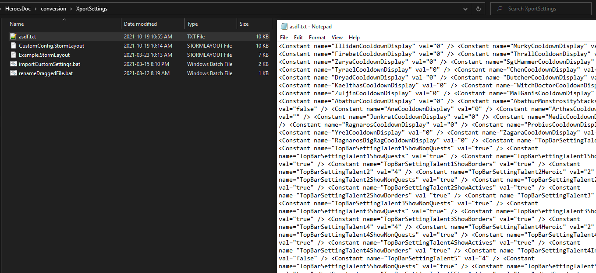  
  Then save that file

  * Step 4: Drag that newly created file ontop of renameDraggedFile.bat, as seen here 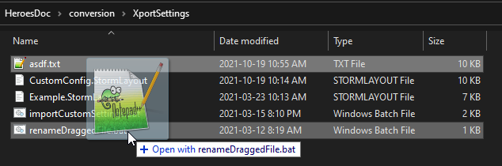  
  This will rename the file to the appropriate file name

  * Step 5: Navigate to where you placed the original .StormInterface file back during the installation of it, and drag and drop it on top of the importCustomSettings.bat file, as seen here 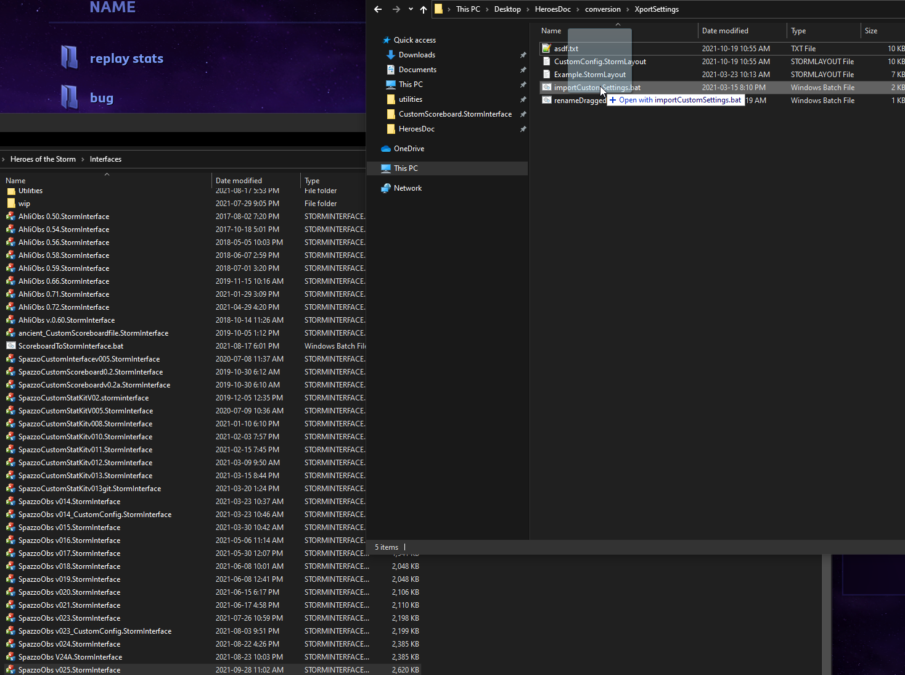

  * Step 6: Select the newly created interface in your game options, as seen here 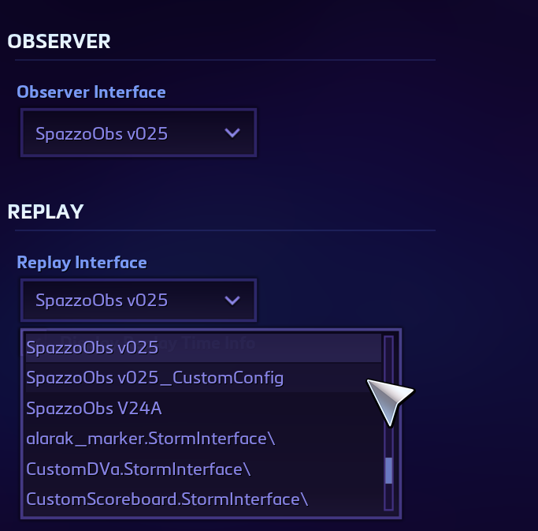

* Installing and using the expanded replay statistics, step-by-step:

  * Step 1: Extract the maps.zip file to your Heroes of the Storm installation folder(meaning the one located in your Program Files folder), making note that the folder structure inside looks like this 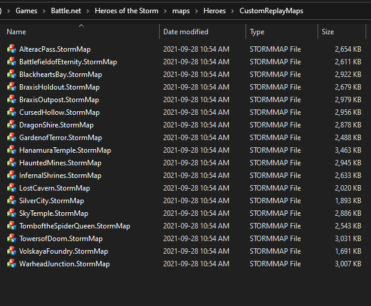

  * Step 2: Drag the replay you desire to watch with the expanded replay statistics on top of the dragAll_details.bat file, contained in the conversion.zip file(after having extracted that to your desired location), as seen here 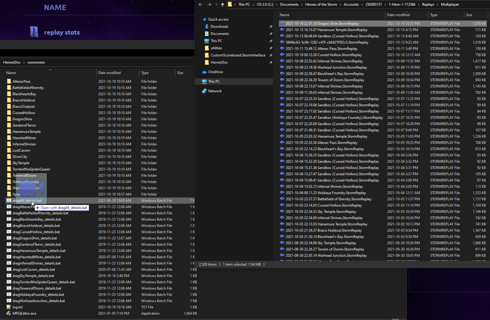

  * Step 3: This will create a copy of that replay with affix of _stats, and you can open that as a standard replay in the Heroes of the Storm game client for offline replay use, as seen here 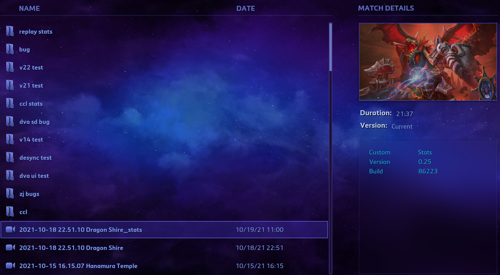

outside software included in this repository:

http://www.zezula.net/en/mpq/download.html - MPQ editor to simplify the replay conversion process
